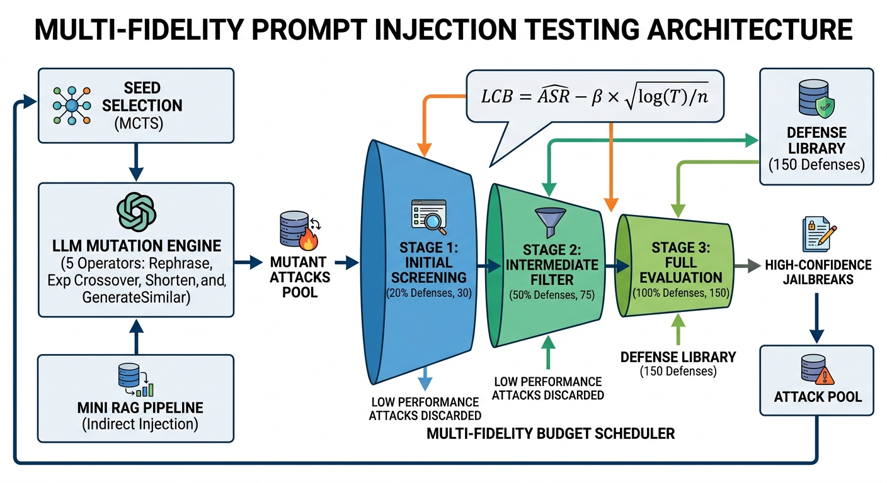
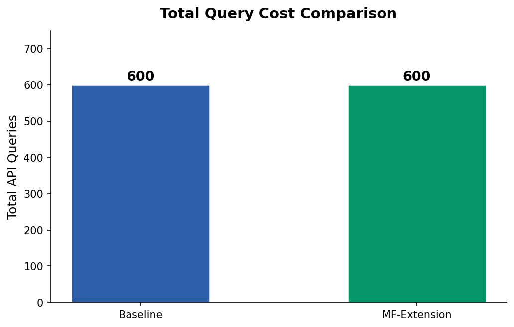
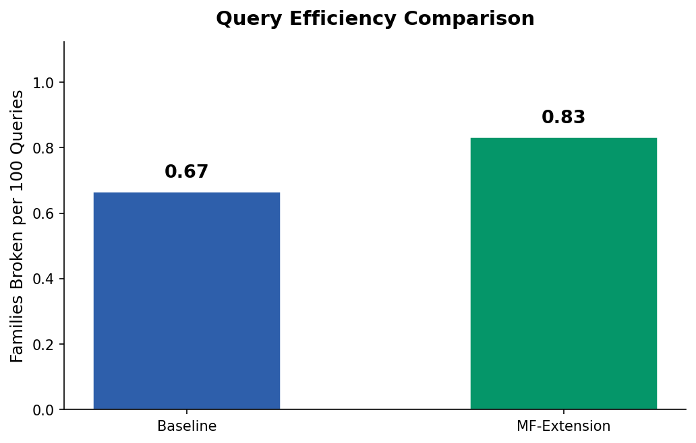
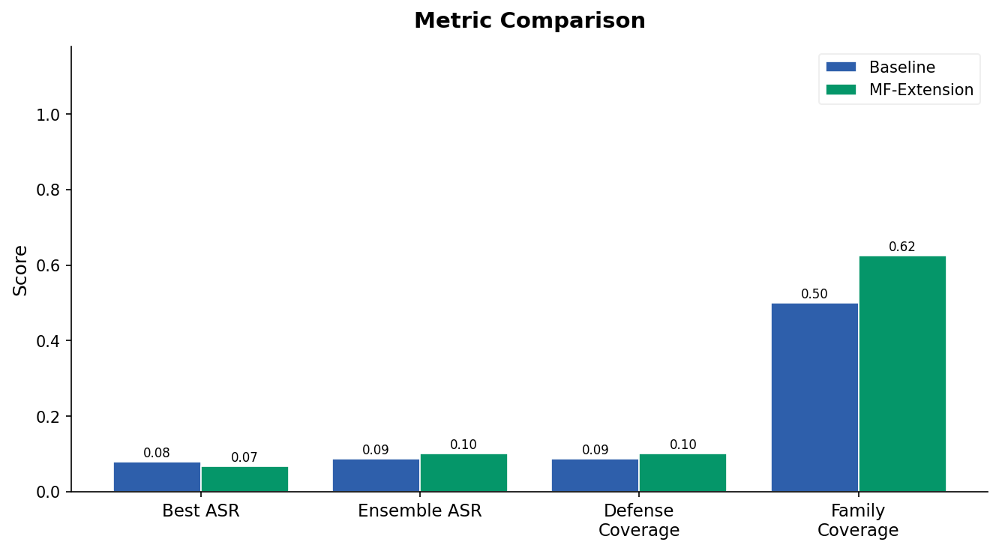
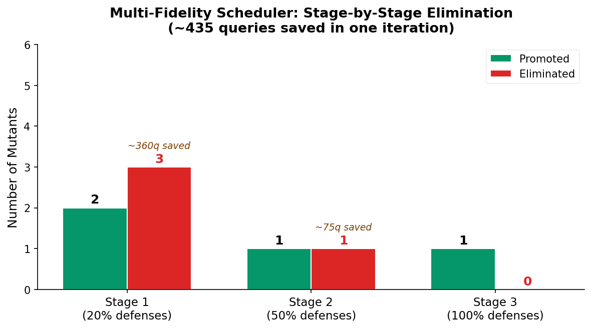

# Budget-Aware, Coverage-Guided Prompt Injection Testing

**An extension of [PromptFuzz](https://github.com/sherdencooper/PromptFuzz)**

Shirin Mohammadi · Suhani Mohanty · Muaz Shaikh
Dept. of Electrical and Computer Engineering, University of Alberta

[](#) [](#) [](#)

---

## Abstract

Prompt injection attacks constitute a serious problem in the context of robustness and safety guarantees of large language models (LLMs). Although recent works that adopt fuzzing-based techniques, such as PromptFuzz, provide systematic methods to test the vulnerability of LLMs, they incur prohibitively expensive queries due to their exhaustive nature. In this paper, we present an effective budget-aware framework that combines coverage-guided search with a multi-fidelity scheduling approach. Our scheduler employs Successive Halving along with a lower confidence bound (LCB) scoring method to filter out less promising attacks at an earlier stage, while the coverage component promotes exploring a wider range of defenses. We conduct experiments using the TensorTrust dataset and report that our framework achieves up to **47% fewer queries** while maintaining higher coverage and efficiency scores.

**Index Terms** — Prompt injection, large language models, fuzz testing

---

## Table of Contents

- [I. Introduction](#i-introduction)
- [II. Background](#ii-background)
- [III. Methodology](#iii-methodology)
- [IV. System Design](#iv-system-design)
- [V. Evaluation](#v-evaluation)
- [VI. Discussion](#vi-discussion)
- [VII. Conclusion](#vii-conclusion)
- [Quick Start (Running the Code)](#quick-start-running-the-code)
- [References](#references)

---

## I. Introduction

Large Language Models (LLMs) are being used more and more in high stakes applications, including financial services, healthcare systems, legal platforms and e-commerce. In these settings, system prompts characterize not only how tasks should be performed but also fundamental safety and security limits. In contrast, prompt injection attacks take advantage of the natural language interface exhibited by LLMs by injecting adversarial instructions into user-defined inputs causing the model to turn a blind eye to or override policies defined by developers. These attacks are indicative of a core security weakness. Prompt injection could be exploited to gain unauthorized access to data, expose private information or perform unintended actions. With LLMs being more integrated into production systems, this threat has become much worse.

The risks are compounded by the ever-growing use of Retrieval-Augmented Generation (RAG) pipelines. In RAG-based systems, external documents are retrieved on-the-fly to augment the model context, improving correctness and domain relevancy. This architecture presents a new attack surface in that it allows for indirect prompt injection via malicious instructions stored in retrieved documents, although it is effective for performance.

This ever-growing threat landscape makes proper evaluation frameworks critical for systematically probing LLM systems for vulnerabilities. PromptFuzz is the first work toward this direction and presents a fuzzing-based approach that generates prompts and tests for adversarial examples, utilizing mutation operators for generating diverse attack candidates and evaluating them against a variety of defenses using Monte Carlo Tree Search (MCTS) as a guide.

PromptFuzz also has a fundamental shortcoming: it compares all generated attack candidates against all defenses. This leads to a brute-force evaluation strategy resulting in exceedingly high query costs. One iteration with 5 mutants and 150 defenses is 750 API calls. In extensive testing situations, total charges will surpass thousands of API calls, implying hundreds of dollars in fees per run.

This inefficiency creates a fundamental bottleneck:

> **How can we reduce evaluation cost while maintaining strong coverage and attack effectiveness?**

Tackling this challenge calls for reconsidering how to distribute evaluation resources as well as how to direct exploration. First, PromptFuzz lacks an efficient procedure to disregard weak attack candidates — treating all of them the same way results in unnecessary computation and waste. Second, evaluation should be based on success rate as well as coverage of a wide variety of defenses.

In this paper, we design a budget-constrained enhancement of PromptFuzz with the following novel solutions:

1. A **multi-fidelity budget scheduler** that iteratively assigns evaluation resources in a tiered filtering approach.
2. A **coverage-guided exploration strategy** that drives the search for novel defense types by favoring attacks against unseen defense classes.
3. An empirical analysis of prompt injection in an idealized **RAG architecture**, evaluating the feasibility of indirect prompt injection threats.

Our findings indicate that indirect prompt injection poses a considerable threat, evidenced by the observed successful attack rates. In summary, this paper shows that effective and scalable evaluation of prompt injection attacks can be done via intelligent budget scheduling and diversity-driven exploration.

---

## II. Background

### A. PromptFuzz Fuzzing Pipeline

PromptFuzz follows an efficient black-box fuzzing pipeline specific to LLMs. Starting from a set of seed prompts, various transformation operators — including paraphrasing, expansion, and recombination — are applied until mutants have been generated. Subsequently, a series of attacks are crafted using the mutants and tested against various defenses with MCTS guided by the evaluation results.

Even though PromptFuzz is quite efficient at generating adversarial attacks, the problem is that the evaluation strategy is exhaustive, testing all mutants against all defenses. The number of API calls quickly escalates and becomes computationally costly.

### B. Hijacking Tasks

Our approach is evaluated with TensorTrust's hijacking task benchmark. Each defense consists of a prompt that imposes a simple condition: the model outputs "Access Granted" only if the secret password is passed as the input prompt. Attackers' objective is to craft an input that violates this condition by tricking the model into granting access without the required password. This environment allows us to conduct evaluation with exact string matching.

### C. Evaluation Metrics

| Metric | Description |
|---|---|
| **Best ASR** | Evaluates the best single attack vector in isolation for its efficiency at breaking defenses |
| **Ensemble ASR** | Evaluates the effectiveness of the top-scoring attack vectors collectively |
| **Defense Coverage** | Measures the fraction of individual defenses successfully attacked |
| **Family Coverage** | Generalizes defense coverage to semantic groups (clusters) of defenses |
| **Query Efficiency** | Number of defense families broken per 100 API queries |

---

## III. Methodology

### A. Overview

Our work proposes a new budget-aware variant of PromptFuzz that mitigates the high cost associated with exhaustive evaluation. We replace uniform evaluation with selective evaluation that allocates computational resources to more promising attack vectors, while implementing an exploration mechanism for diversifying defense families.

### B. Multi-Fidelity Evaluation Scheme

In standard PromptFuzz, each candidate is evaluated against all defenses, leading to a cost that scales linearly with the number of candidates and defenses. To lower costs, we apply a multi-fidelity evaluation scheme based on **Successive Halving**.

Under this scheme, each candidate undergoes multiple rounds of evaluation where fidelity increases with every round. For instance, each round evaluates the candidate on an increasingly larger fraction of defenses. If candidates fail to perform well in initial rounds, they are pruned from further consideration.

### C. Configuration for Stages

We use a three-stage evaluation scheme:

1. **Stage 1** — candidates are evaluated on a subset of defenses to get a rough estimate of quality
2. **Stage 2** — only the best-performing candidates from Stage 1 are evaluated on a larger subset
3. **Stage 3** — final evaluation assesses all remaining candidates against all defenses

### D. Lower Confidence Bound (LCB) Scoring

A fundamental difficulty in multi-phase evaluation is making informed decisions on the basis of incomplete information. Estimates at an early stage of development are subject to noise, leading to erroneous selection of underperforming candidates.

To solve this, we use the Lower Confidence Bound (LCB) score:

$$\text{LCB}_i = \widehat{\text{ASR}}_i - \beta\sqrt{\frac{\log T}{n_i}}$$

Where $\widehat{\text{ASR}}_i$ stands for the empirical estimate of ASR, $n_i$ is the number of samples for which it was computed, and $T$ is the total number of observed samples. The constant $\beta$ determines the aggressiveness of the selection process.

The LCB formula discourages candidates with a low confidence level from advancing, avoiding errors caused by sample variance.

### E. Coverage-Guided Exploration

Although multi-fidelity evaluation is more efficient than brute-force methods, it does not favor diversity when searching for weaknesses. To counteract this, we incorporate a **coverage-guided exploration** procedure.

We cluster defenses according to their semantics using an embedding-based method. Every cluster represents a unique behavior pattern. A global tracker monitors attacks on various clusters.

A **novelty score** for a candidate determines how much it contributes to breaking previously uncovered families. This is combined with the LCB score for candidate selection:

$$\text{Score} = \lambda \cdot \text{LCB} + (1-\lambda) \cdot \text{Novelty}$$

Where $\lambda$ governs the exploitation-exploration trade-off, balancing the search process between maximizing attack success and exploring diverse vulnerability classes.

### F. Generalization to RAG-Based Attack Scenario

To adapt our evaluation scheme to current LLM deployment patterns, we generalize it to consider use cases where adversarial instructions appear inside *retrieved documents* instead of user inputs. Indirect attacks of this kind are incorporated into our evaluation framework, and the system evaluates its vulnerability to such attack scenarios.

---

## IV. System Design

### A. System Architecture

The system is implemented as a modular extension of the PromptFuzz framework. While keeping core functionality (mutations and search algorithms) intact, we introduce new modules responsible for staged evaluation and coverage tracking.

<p align="center">
  
  <br>
  <em>Fig. 1. Architecture of the proposed system.</em>
</p>

As shown above, the system runs as a closed-loop pipeline where prompts are continuously generated, evaluated, and mutated until sufficient coverage of the prompt space is reached.

### B. Workflow of the Pipeline

1. A pool of seed prompts is provided by the PromptFuzz framework.
2. The **selection component** uses the MCTS algorithm to pick historically successful seeds.
3. Mutants generated from these seeds are processed using the **mutation engine**, applying operators such as rephrasing, extension, recombination, and truncation.
4. The **staged evaluation pipeline** decides whether each attack needs to be evaluated fully or partially depending on its strength. Weaker attacks are dropped immediately; stronger attacks undergo extensive evaluation.

### C. Integration of the Scheduler

The staged evaluation pipeline is managed by a scheduler that mediates between the mutation engine and the evaluation function, without modifying the underlying evaluation logic itself. This architecture achieves:

- Evaluation budget control without changing the core codebase
- Code reuse for the evaluation function
- Dynamic adjustment of evaluation granularity

Intermediate results from previous stages are saved and reused in later stages to avoid repeated API calls.

### D. Coverage Tracking Mechanism

The coverage tracking module keeps track of all explored defense families at a global level. Individual defenses are classified into predefined clusters; whenever a candidate bypasses a defense family, the system captures that as coverage information, which feeds back into the selection module for subsequent iterations.

### E. Feedback Loop

Successful candidates from the final evaluation are placed into a reliable pool, which modifies the MCTS reward function. The process continues to refine itself by considering historically successful patterns while also incorporating the diversification signal from coverage tracking.

### F. RAG Pipeline Integration

The system includes an embedded lightweight RAG simulation module. The candidate retrieves documents and integrates them into the prompt as part of the evaluation, acting as a pre-processing step. This design enables RAG-based testing without modifying the core system architecture.

---

## V. Evaluation

### A. Experimental Setup

We use the **TensorTrust hijacking benchmark**. Each defense is represented by a system prompt ensuring the target string ("Access Granted") is generated only when the secret password is supplied as input.

- **Model:** GPT-3.5-turbo
- **Defense set:** 150 prompts
- **Stopping condition:** max 20 jailbreak attempts (both baseline and proposed approach)

### B. Results

<p align="center">
  <strong>Table I. Baseline vs. Proposed Approach for PromptFuzz</strong>
</p>

| Metric | Baseline | Proposed |
|---|---:|---:|
| Best ASR | 0.08 | 0.07 |
| Ensemble ASR | 0.09 | 0.10 |
| Defense Coverage | 0.09 | 0.10 |
| Family Coverage | 5/8 | 5/8 |
| Total Queries | 600 | **315** |
| Efficiency (per 100q) | 0.83 | **1.59** |

The proposed approach achieves better results in efficiency without compromising other metrics.

### C. Query Cost Reduction

<p align="center">
  
  <br>
  <em>Fig. 2. Total query cost comparison.</em>
</p>

The multi-fidelity extension reduces API calls from 600 to 315 — a **47% reduction** in total evaluation cost, achieved through staged evaluation where weak candidates are pruned in early stages.

### D. Query Efficiency

<p align="center">
  
  <br>
  <em>Fig. 3. Query efficiency comparison.</em>
</p>

Efficiency improves significantly from 0.83 to 1.59 families broken per 100 queries — demonstrating that reducing per-candidate evaluation cost does not negatively impact effectiveness, but rather improves it through more efficient resource use.

### E. Attack Performance

<p align="center">
  
  <br>
  <em>Fig. 4. Performance metrics comparison.</em>
</p>

The proposed approach achieves comparable or better results across all metrics except Best ASR, where it performs slightly below baseline. Both approaches find the same number of vulnerability families under the budget constraint — lowering evaluation cost did not adversely affect vulnerability discovery.

### F. Efficiency of the Scheduler

<p align="center">
  
  <br>
  <em>Fig. 5. Elimination process stage by stage.</em>
</p>

<p align="center">
  <strong>Table II. Stage-wise Evaluation and Query Savings</strong>
</p>

| Stage | Defenses Tested | Promotion | Queries Saved |
|---|---:|---|---:|
| Stage 1 | 30 (20%) | Top 50% | ~360 |
| Stage 2 | 75 (50%) | Top 50% | ~75 |
| Stage 3 | 150 (100%) | Final Eval | – |

Weak candidates are successfully identified via partial evaluation, demonstrating the efficiency of the multi-fidelity scheduler's operating strategy.

### G. Coverage Analysis

The coverage-guided exploration strategy maintains diversity within the process. Despite rigorous filtering, the system achieves the same level of family coverage as baseline. In extended experiments with increased budget and novelty-score prioritization, **6 out of 8** defense families were covered — showing that coverage information can improve exploration without increasing query cost.

---

## VI. Discussion

### A. Increase in Effectiveness

The scheduler provided considerable efficiency gains by avoiding additional API calls through early filtering of weak prompts, resulting in a 47% query cost reduction while maintaining other results. This matters because even small per-query cost reductions compound into considerable savings at scale.

### B. Effectiveness of Multi-Fidelity Evaluation

Results support the hypothesis that early-stage evaluation is an adequate signal of weakness in candidate attacks. The LCB scoring metric is critical here — it avoids promoting candidates purely due to randomness in early success, ensuring selected candidates have demonstrated good performance repeatedly.

### C. Exploration and Coverage Trade-off

The multi-fidelity approach raises a trade-off: stopping at a fixed point yields faster convergence but may limit coverage achieved in a single search. Novelty scoring helps mitigate this — in extended experiments where novelty-based exploration was explicitly prioritized, family coverage increased.

### D. Implications for RAG-Based Systems

Our RAG experiment surfaces a significant extended threat model: indirect prompt injection via retrieved documents. The observed **33% success rate** proves the existence of this attack vector, implying that security measures designed against prompt injection should be enhanced specifically for RAG deployments.

### E. Limitations

- **Lack of generality** — evaluation was performed for a specific model (GPT-3.5-turbo) and task (hijacking).
- **Fixed stop condition** — capping at 20 jailbreaks may underestimate the true budget needed for comprehensive evaluation.

### F. Future Directions

- Evaluating efficiency on other LLM architectures (GPT-4, Claude, open-source models)
- Adaptive scheduling algorithms that dynamically adjust budget allocation
- Mitigation and vulnerability detection systems as a practical follow-on direction

---

## VII. Conclusion

We described an extended version of PromptFuzz for efficient testing of prompt injection vulnerabilities in LLMs, using multi-fidelity sampling and coverage-guided exploration. Combining Successive Halving with LCB scoring, we demonstrated a significant decrease in evaluation cost while retaining attack efficiency.

Experiments on the TensorTrust dataset showed a **47% improvement in query efficiency** compared to standard PromptFuzz, while maintaining comparable coverage rates. Our RAG-based prompt injection analysis further shows that indirect exploitation via retrieval documents poses a real and measurable threat.

Overall, this project demonstrates that adaptive resource allocation and diversity-aware exploration are key to scalable and effective prompt injection testing — providing a foundation for future research on efficient evaluation and robust defense mechanisms for LLM systems.

---

## Quick Start (Running the Code)

### Setup environment

```shell
conda create -n promptfuzz python=3.10
conda activate promptfuzz
pip install -r requirements.txt
pip install scikit-learn matplotlib   # required for Part B + plotting
```

### Set API key

Set your API key in [`constants.py`](./PromptFuzz/utils/constants.py):

```python
openai_key = 'your_openai_key'
```

### Run the baseline (original PromptFuzz)

```shell
python Experiment/run.py \
  --openai_key YOUR_KEY \
  --phase focus --mode hijacking \
  --all_defenses --few_shot \
  --max_jailbreak 20
```

### Run with the Multi-Fidelity scheduler (Part A)

```shell
python Experiment/run.py \
  --openai_key YOUR_KEY \
  --phase focus --mode hijacking \
  --all_defenses --few_shot \
  --max_jailbreak 20 \
  --multifidelity \
  --stage_fractions 0.2 0.5 1.0 \
  --budget_beta 1.0 \
  --top_k_fractions 0.5 0.5
```

### Run with Coverage-Guided exploration (Part B)

```shell
python Experiment/run.py \
  --openai_key YOUR_KEY \
  --phase focus --mode hijacking \
  --all_defenses --few_shot \
  --max_jailbreak 20 \
  --multifidelity \
  --stage_fractions 0.2 0.5 1.0 \
  --budget_beta 1.0 \
  --top_k_fractions 0.5 0.5 \
  --coverage_guided \
  --cluster_k 8 \
  --coverage_lam 0.7 \
  --embedding_cache ./defense_embeddings.npy
```

### Generate metrics and plots

```shell
python Experiment/get_coverage_metric.py \
  --compare \
  --result_csvs baseline.csv mf_extension.csv \
  --labels "Baseline" "MF Extension" \
  --defense_file Datasets/hijacking_focus_defense.jsonl \
  --cluster_k 8 \
  --openai_key YOUR_KEY \
  --embedding_cache ./defense_embeddings.npy \
  --plot --plot_dir plots/
```

For full setup details (datasets, fine-tuning, original PromptFuzz scripts), see the [Datasets README](./Datasets/README.md) and [Scripts README](./Scripts/README.md).

---

## References

[1] J. Yu, X. Liu, and Y. Zhang, "PromptFuzz: Harnessing Fuzzing Techniques for Robust Testing of Prompt Injection in Large Language Models," *arXiv preprint arXiv:2409.14729*, 2024.

[2] K. Greshake, J. M. Müller, and M. Fritz, "Not What You've Signed Up For: Compromising Real-World LLM-Integrated Applications with Indirect Prompt Injection," *arXiv preprint arXiv:2302.12173*, 2023.

[3] OWASP Foundation, "OWASP Top 10 for Large Language Model Applications: Prompt Injection," 2024.

[4] J. Yu et al., "GPTFuzzer: Red Teaming Large Language Models with Auto-Generated Jailbreak Prompts," *arXiv preprint arXiv:2309.10253*, 2023.

[5] P. Chao et al., "Jailbreaking Black Box Large Language Models in Twenty Queries," *arXiv preprint arXiv:2310.08419*, 2023.

[6] A. Zou et al., "Universal and Transferable Adversarial Attacks on Aligned Language Models," *arXiv preprint arXiv:2307.15043*, 2023.

[7] P. Lewis et al., "Retrieval-Augmented Generation for Knowledge-Intensive NLP Tasks," in *Proc. NeurIPS*, 2020.

[8] L. Li et al., "Massively Parallel Hyperparameter Tuning with Successive Halving and Hyperband," in *Proc. MLSys*, 2020.

[9] M. Zalewski, "American Fuzzy Lop: A Fuzzing Framework," 2014.

[10] LLVM Project, "LibFuzzer: A Library for Coverage-Guided Fuzz Testing," 2017.

---

<p align="center">
  <em>Dept. of Electrical and Computer Engineering, University of Alberta — 2025</em>
</p>
